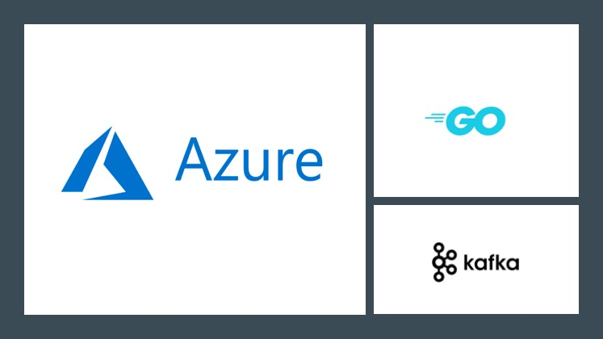

## Connect to Azure Event Hubs for Kafka using Go

This blog will demonstrate how to interact with [Event Hubs Kafka](https://docs.microsoft.com/azure/event-hubs/event-hubs-for-kafka-ecosystem-overview?WT.mc_id=eventhubskafkagosarama-github-abhishgu) cluster using the [Sarama Kafka client](https://github.com/Shopify/sarama) library. The [`sarama` package](https://godoc.org/github.com/Shopify/sarama) provides a pure Go client that supports Kafka v 0.8 and above.

[Azure Event Hubs](https://docs.microsoft.com/azure/event-hubs/?WT.mc_id=eventhubskafkagosarama-github-abhishgu) is a streaming platform and event ingestion service, capable of receiving and processing millions of events per second. It also provides a Kafka endpoint that can be used by your existing Kafka based applications as an alternative to running your own Kafka cluster. Since Azure Event Hubs exposes a protocol that is binary compatible with Kafka versions 1.0, you can start using the Kafka endpoint from your existing applications with no code change but a minimal configuration change. This also supports frameworks like [Kafka Connect](https://kafka.apache.org/documentation/#connect) (currently in preview), [MirrorMaker](https://kafka.apache.org/documentation/#basic_ops_mirror_maker) etc.
